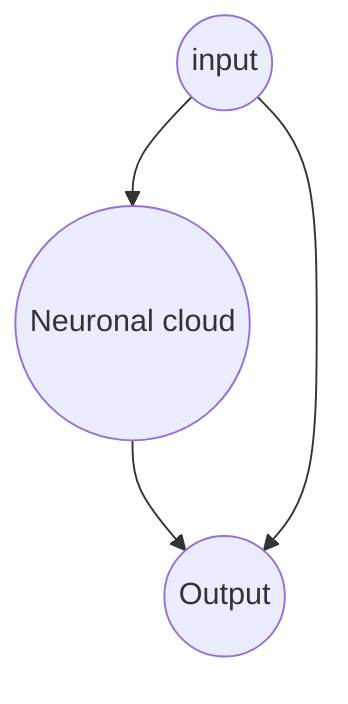

Snake brain should have some sort of memory to allow complex behaviours 
For performance and because more precision isn't needed, i8 describes the state and the synapses between neurons. They are multiplied by each other into an i16 then summed up then divided by 256 to fit into 8 bits.
## input 
- One neuron per square which get bigger and bigger
- Empty => unactivated, Snake/Wall => -127, Apple/Egg => 127
- That's tewenty-five input neurons total

## output 
- One neuron per direction, whatever neuron is the most excited gets chosen.
- That's four output neurons
- maybe the output neurons could be considered as internal neurons and influence internal neurons
## internal neurons
- They are also 16, brain_state is the state of the internal neurons
## optimizations
brain state exists twice: they alternate between current and former state to avoid reallocating memory. The former state is used to calculate the new one.
It avoids instruction dependencies and allow for use of graphics card probably.
A single step is played every frame.
## synapses
The genome dictates the synapses between neurons. Synapses do not have to go from left to right. They carry weights. A neuron also has a synapse on itself positively or simply takes into account its former state.
