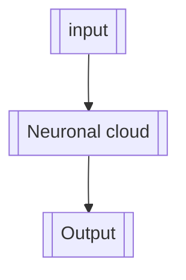

Snake brain should have some sort of memory to allow complex behaviours 
## Brain input 
- the ability of Sight 
- body state/picture
should sight be direction agnostic, that is, should it see the world the way an actual snake or more like the player
## Brain output 
- movement direction
should direction be indicated relative to current direction
## Brain optimizations
brain state exists twice: they alternate between current and former state to avoid reallocating memory. The former state is used to calculate the new one.
It avoids instruction dependencies and allow for use of graphics card probably.
A single step is played every frame.
## Brain genome 
The genome dictates the synapses between neurons. Synapses do not have to go from left to right. They carry weights. A neuron also has a synapse on itself positively or simply takes into account its former state.
